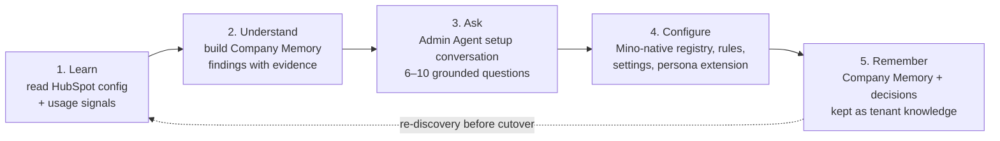
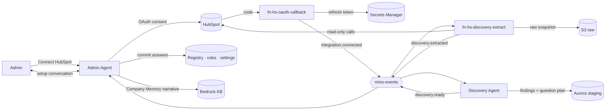

# Mino — HubSpot Discovery Agent & Migration Design

**Version:** v0.3 (draft for review) · **Date:** 2026-10-08 · **Owner:** Amir (CEO) · **Architecture review:** Oded (CTO)
**Status:** Validated against a real HubSpot test account on 2026-10-08 (§14). Auth changed to a customer-created Service Key (D3, D7); workflows are not readable that way, so automation intent is asked and inferred (D8). O3 (tasks) still parked.
**Related docs:** `mino-tech-design-v0.4.md` (TDD), `MinoERD.jsx` v0.5, `mino-salesforce-cdc-integration-spec-2026-07-28.md` (sync pattern reused in Part B), `mino_cadence_schema.sql`

**What changed from v0.1:** v0.1 treated discovery as a *translator* — HubSpot config compiled 1:1 into Mino's registry and rules. v0.2 treats it as a *learner*. Mino reads HubSpot to build a **Company Memory** (how this company actually sells), then the Admin Agent runs a short setup conversation where every question is grounded in what Mino learned. Answers configure Mino natively. Nothing in Mino depends on HubSpot after cutover; HubSpot is a source of evidence, not a platform.

---

## 0. Decisions captured for this design

| # | Question | Decision |
|---|---|---|
| D1 | Primary job of the Discovery Agent | Configure Mino for the customer — via learning + admin questions (refined by D6) |
| D2 | What Mino reads | Schema + pipelines (objects, custom objects, properties, validation rules, pipelines, stages, association labels) and Workflows |
| D3 | Auth model | **Changed 2026-10-08:** no Mino-built HubSpot app. The customer creates a read-only **Service Key** in their HubSpot and pastes it into Mino during setup (supersedes the public OAuth app in v0.1/v0.2) |
| D7 | Live sync during cutover window | Service Keys cannot receive webhooks → delta sync is **polling only** (reconcile poll, §8.4) |
| D8 | Automation rules (workflows) | HubSpot blocks workflow reads for Service Keys (§14). V1: **ask + infer** — Admin Agent asks 2–3 process questions; Mino infers automations from behaviour (e.g. identical tasks created right after a stage change) |
| D4 | Migration model | Cutover + delta sync: full historical load, temporary sync until the customer switches HubSpot off |
| D5 | Region | us-east-1 primary / us-west-2 DR (locked). The brief's il-central-1 line is superseded |
| **D6** | **Product principle** | **Mino does not build on top of HubSpot or replicate it.** Discovery extracts *company memory and process* as evidence; the Admin Agent asks the admin questions based on that evidence; the answers configure Mino in Mino's own model. HubSpot structures are never copied 1:1 without an admin decision |

### What D6 means in practice

| Not this (v0.1 instinct) | This (v0.2) |
|---|---|
| Import all 140 custom fields | Learn which 12 fields the team actually fills, ask about the 3 that look important but are empty |
| Recreate the 9-stage pipeline | "Deals skip *Demo Done* 70% of the time — keep it, merge it, or drop it?" |
| Compile each workflow into a Mino rule | Extract the *intent* ("big deals need legal review"), ask whether Mino should own it, then Mino authors its own native rule |
| Keep HubSpot reminder/task workflows | "4 of your workflows exist to chase reps for updates. Mino speaks first and does this itself — retire them?" |
| Review screen of 300 mapping rows | 6–10 questions, multiple choice, HubSpot-informed default pre-selected |

Out of scope for V1: sequences as a migrated asset, users/teams/permission sets as *rules* (owners are still migrated as data, §8.2), pre-sale audit report. Each is a cheap add-on later because every raw payload is kept (§6.1).

---

## 1. Why this exists

HubSpot is the most likely incumbent for Mino's buyer (VP Sales, B2B tech, 10–50 employees). The switching cost is not the data — data moves. The switching cost is **knowing how the company sells**: which stages matter, which fields reps actually fill, which rules the VP Sales cares about, and which HubSpot automations were workarounds for a CRM nobody updates.

HubSpot holds that knowledge, scattered and half-stale. Mino reads it, distils it into a Company Memory, and turns it into a conversation:

> *"I read your HubSpot. You run one sales pipeline with 9 stages, but in the last 12 months your won deals went straight from Discovery to Proposal 70% of the time. I'd set Mino up with 6 stages. Want to see them?"*

That conversation *is* the 4-minute setup — for a customer that already has history. It is also the GTM line: **"Connect HubSpot. Mino learns how you sell, asks you seven questions, and you're live."**

**Design principles**

1. **Read-only, always.** Mino never writes to HubSpot.
2. **Evidence, not migration of configuration.** Every learned item carries its evidence (counts, examples, source) and a confidence.
3. **Ask only what changes the setup.** A finding becomes a question only if the answer changes Mino's configuration and Mino can't decide confidently alone.
4. **Every question has a default.** Pre-selected from evidence, so a busy VP Sales can accept in one tap.
5. **Mino-native output.** Answers are written into Mino's own registry, rules and settings. HubSpot IDs live only in provenance and the migration crosswalk.
6. **Write = confirm.** Nothing reaches the live configuration without the admin's answer or explicit acceptance.

## 2. HubSpot platform facts that shape this design (state as of Oct 2026)

These changed during 2026 and directly constrain the build. Re-verify before implementation — HubSpot ships platform changes twice a year.

| Fact | Design consequence |
|---|---|
| APIs moved to **date-based versioning** (`/2026-03/`, `/2026-09/`; betas suffixed `-beta`). Legacy `v3`/`v4` paths stay supported until `/2027-03/` ships. | Build a **version adapter**: every endpoint path comes from one config map, pinned per endpoint. Never hard-code `v3`. |
| **Legacy public apps can no longer be created** (since 2026-06-23); **legacy private apps** can no longer be created in new accounts (from 2026-09-28; existing accounts from 2026-10-26). **Service Keys** replace them for in-account API access. | D3: Mino uses a customer-created Service Key, no app. Service Keys cannot receive webhooks and should be rotated every 6 months. |
| **Service Keys cannot read workflows** (verified 2026-10-08: list returns empty, read-by-ID returns 403 `FlowApi…`, even for the key that created the workflow). | D8: workflow intent comes from questions + behavioural inference, not the workflows API. |
| ~~Unlisted marketplace apps capped at 25 installs~~ | Not applicable after D3 (no app). |
| OAuth marketplace apps get **110 requests / 10 s per installed account**; the API-limit add-on does not raise it. | ~10 req/s sustained budget per tenant. Discovery fits easily; migration math in §8.3. |
| **CRM Search API: 5 req/s per account, shared by every app in that account; 10,000 results max per query; 200/page.** | Never use search for bulk load. Use list endpoints. Search only for delta windows and counts, capped at ~2 req/s to stay polite to the customer's other integrations. |
| **Workflows API (automation v4) is beta.** List call returns key fields only; full definition needs one GET per flow. Flows with incomplete required action fields can error on GET. | Per-flow fault isolation; raw payload stored; intent classifier tolerant of unknown action types. |
| Workflows require a Professional/Enterprise HubSpot tier. | Many 10–50 employee targets are on Starter → no workflows to discover. `automation` scope goes in **optional** scopes so install still succeeds on Starter. |
| Property **validation rules** are readable via API (`property-validations`). From `/2026-09/` GA, HubSpot enforces them on all CRM API writes. | We read them into registry constraints. Enforcement change only matters if Mino ever writes back to HubSpot (not in V1). |
| Exports API: **30 exports / rolling 24 h, one at a time**; OAuth installer must be Super Admin to grant `crm.export`. | Not the primary migration path. Optional accelerator for very large contact tables. |

---

## 3. HubSpot metadata model — what discovery reads

### 3.1 Endpoint inventory (V1 scope)

Paths shown in date-versioned form; the adapter resolves the pinned version per endpoint.

| Area | Endpoint(s) | Scope(s) | What we extract |
|---|---|---|---|
| Account | `GET /account-info/2026-03/details` | `oauth` | portalId, timezone, company currency, UTC offset, data hosting location, account type |
| Custom object schemas | `GET /crm-object-schemas/2026-03/schemas` (incl. properties + association definitions) | `crm.schemas.custom.read` | custom object types, `objectTypeId` (`2-xxxxx`), labels, primary/secondary display properties, associations |
| Properties (per object) | `GET /crm/properties/2026-03/{objectType}` | `crm.schemas.{contacts,companies,deals}.read`, `crm.objects.custom.read` | name, label, type, fieldType, options, groupName, `calculated` + `calculationFormula`, `hasUniqueValue`, `hubspotDefined`, `externalOptions`, hidden, sensitivity |
| Property groups | `GET /crm/properties/2026-03/{objectType}/groups` | same | grouping → Mino field sections |
| Validation rules | `GET /crm/property-validations/2026-03/{objectTypeId}` | schema read scopes | ruleType + ruleArguments per property (format, length, numeric ranges…) |
| Pipelines & stages | `GET /crm/pipelines/2026-03/{objectType}` | `crm.objects.deals.read`, `tickets` | pipelines, stages, `displayOrder`, stage `metadata.probability` (deals), `metadata.isClosed`, `metadata.ticketState` (tickets) |
| Pipeline audit (optional) | `GET /crm/pipelines/.../{pipelineId}/audit` | same | change history — useful to explain "why is this stage here" |
| Association labels | `GET /crm/associations/2026-03/{from}/{to}/labels` | object read scopes | `HUBSPOT_DEFINED` vs `USER_DEFINED` labels (e.g., "Decision maker") |
| Association limits | `GET /crm/associations/2026-03/definitions/configurations/all` | same | max associations per pair (cardinality hints) |
| Owners | `GET /crm/owners/2026-03` (+ `archived=true`) | `crm.objects.owners.read` | owner id ↔ userId ↔ email ↔ teams (needed by workflow actions like rotate-to-owner, and by migration) |
| Users / teams / roles | `GET /settings/users/2026-03`, `/teams`, `/roles` | `settings.users.read`, `settings.users.teams.read` | team structure for assignment rules (optional scope) |
| Lists (segments) | `POST /crm/lists/2026-03/search`, `GET /crm/lists/2026-03/{listId}` | `crm.lists.read` | **only lists referenced by workflows** — their filters help explain a workflow's intent (who it targets) |
| Workflows | `GET /automation/v4/flows` → `POST /automation/v4/flows/batch/read` (or per-flow GET) | `automation` | full flow spec: type, objectTypeId, enrollmentCriteria, actions graph, branches, re-enrollment, suppression lists, time windows, blocked dates |
| Usage signals (§5.3) — counts per stage/owner/period, ≤200-deal stage-history sample | `POST /crm/objects/2026-03/{type}/search` (`limit:1`, read `total`); `GET /crm/objects/2026-03/deals?propertiesWithHistory=dealstage` | object read scopes | how the company actually sells: stage flow, cycle time, win rate, team size |
| Property usage (recommended) | `POST /crm/objects/2026-03/{type}/search` with `HAS_PROPERTY`, `limit:1`, read `total` | object read scopes | fill-rate per custom property → don't import 300 dead fields |

### 3.2 HubSpot object type IDs

| HubSpot object | objectTypeId | Notes |
|---|---|---|
| Contacts | `0-1` | |
| Companies | `0-2` | |
| Deals | `0-3` | multiple pipelines |
| Tickets | `0-5` | multiple pipelines |
| Leads | `0-136` | newer object; has its own pipeline (verify on test portal) |
| Line items / Products | `0-8` / `0-7` | migrate, not "discover" |
| Calls, emails, meetings, notes, tasks | engagement objects | migrate (§8); not discovery |
| Custom objects | `2-xxxxxx` | from schemas API |

### 3.3 Workflow (flow) anatomy — what the intent classifier reads

```
flow
├── id, revisionId, name, isEnabled, type (CONTACT_FLOW | PLATFORM_FLOW), objectTypeId
├── enrollmentCriteria
│   ├── type: EVENT_BASED | LIST_BASED (filter-based)
│   ├── eventFilterBranches[]  → eventTypeId (e.g. 4-655002 property changed, 4-1463224 object created)
│   ├── listFilterBranch       → nested AND/OR filter tree (list-filter syntax)
│   ├── listMembershipFilterBranches → references list IDs (IN_LIST / NOT_IN_LIST)
│   └── shouldReEnroll, reEnrollmentTriggersFilterBranches, unEnrollObjectsNotMeetingCriteria
├── startActionId
├── actions[]  (a directed graph)
│   ├── SINGLE_CONNECTION: actionTypeId + fields + connection{edgeType STANDARD|GOTO, nextActionId}
│   ├── LIST_BRANCH: listBranches[{filterBranch, connection}] + defaultBranch
│   └── STATIC_BRANCH: inputValue{propertyName} + staticBranches[{branchValue, connection}] + defaultBranch
├── suppressionListIds, timeWindows, blockedDates
└── customProperties, canEnrollFromSalesforce
```

---

## 4. HubSpot → Mino reference mapping

This mapping is **not** an import plan. It is the dictionary the Discovery Agent uses to *interpret* evidence (e.g., "this HubSpot field behaves like Mino's `expected_close_date`") and the default the Migration Agent uses to move records **after** the admin has answered the setup questions. Where an answer differs (merged stages, dropped fields), the answer wins.

### 4.1 Objects → Mino core entities (aligned to MinoERD v0.5)

| HubSpot | Mino table | Mapping notes |
|---|---|---|
| Company | `organizations` | domain, industry, employee count, revenue, owner, parent company → `parent_org_id`; custom props → `ext_attributes` |
| Contact | `contacts` | **ERD conflict:** `contacts.organization_id` is required; HubSpot contacts frequently have no company (§12, O1) |
| Deal | `engagements` (`engagement_type='opportunity'`) | `dealstage` → `stage`, `amount` → `value`, `closedate` → `expected_close_date`/`actual_close_date`. **ERD conflict:** `engagements.organization_id` required; deals without companies exist (O1) |
| Ticket | `engagements` (`engagement_type='ticket'`) | `hs_pipeline_stage` → `stage`; `ticketState` drives open/closed |
| Lead (`0-136`) | `engagements` (`engagement_type='lead'`) | lead status → `lead_status`; association to contact/company |
| Deal ↔ Contact association (+ labels) | `engagement_contacts.role` | `USER_DEFINED` labels like "Decision maker"/"Champion" map to `role` values; unmapped labels kept as `role='other'` + label in mapping table |
| Deal ↔ Company (non-primary, e.g. "Reseller") | `engagement_organizations` | labelled partner associations only; primary company stays on `engagements.organization_id` |
| Calls, emails, meetings, notes | `interactions` | `interaction_type` = call / email / meeting / note; bodies → S3 raw key + `body` |
| Tasks | **no home in ERD** | `activities` is the immutable audit log, not a task list (§12, O3) |
| Products, line items | `products`, `engagement_line_items` | price, quantity, discount; snapshot names |
| Owners | `users` | **ERD conflict:** `users.cognito_sub` required; HubSpot owners aren't Mino users yet (§12, O2) |
| Teams | `teams` | name, manager |
| Custom objects | **no direct home** | fixed-core model. Options in §12, O4 |

### 4.2 Property type mapping → `registry_fields.field_type`

| HubSpot `type` / `fieldType` | Mino `field_type` | Notes |
|---|---|---|
| `string` / `text` | `text` | |
| `string` / `textarea`, `html` | `long_text` | |
| `string` / `phonenumber` | `phone` | normalize to E.164 on load |
| `number` / `number` | `number` | carry `numberDisplayHint` (currency, percentage) into `allowed_values.display` |
| `date` / `date` | `date` | |
| `datetime` / `date` | `datetime` | |
| `enumeration` / `select`, `radio` | `select` | `options[].value` → `allowed_values`, label → label, keep HubSpot value as source key |
| `enumeration` / `checkbox` | `multi_select` | stored `;`-delimited in HubSpot → array |
| `bool` / `booleancheckbox` | `boolean` | |
| `enumeration` with `externalOptions=true` (owner fields) | `user_ref` | resolved via owner map |
| `calculated=true` / `calculation_*` with `calculationFormula` | `computed` | `is_ai_writable=false`; formula preserved; compiled to rule if simple arithmetic, else LLM-fallback flag |
| file / attachment | `file_ref` | content migrated only if O7 says so |
| `hasUniqueValue=true` | sets `is_unique=true` | |
| `hubspotDefined=true` and prefixed `hs_` | **skipped by default** | allow-list of useful system props (`hs_lead_status`, `hs_analytics_source`, `lifecyclestage`, `hs_priority`, …) |

**Filter rule for import:** a custom property is proposed only if (a) fill-rate > 0 (from usage scan), or (b) it is referenced by a workflow, a pipeline, or a validation rule. Everything else is listed as "found, not imported" in the review screen.

### 4.3 Pipelines & stages

| HubSpot | Mino |
|---|---|
| pipeline (per object) | **new** `registry_pipelines` row (ERD delta, §6.3) |
| stage `label`, `displayOrder` | `registry_stages.label`, `display_order` |
| stage `metadata.probability` (0.0–1.0) | `default_probability` (0–100, ×100) |
| `metadata.isClosed=true` + probability 1.0 / 0.0 | `is_won` / `is_lost` |
| ticket `metadata.ticketState` OPEN/CLOSED | `is_active` / closed semantics |
| stage id (e.g. `appointmentscheduled` or numeric) | `stage_name` slug + `source_ref.hubspot_stage_id` |

### 4.4 Validation rules → registry constraints

`property-validations` returns `ruleType` + `ruleArguments` per property. Stored verbatim in `registry_fields.validation_rules` (ERD delta) and compiled to Mino's validator vocabulary: `min_length`, `max_length`, `regex`, `numeric_min`, `numeric_max`, `decimal_places`, `allowed_chars`, `date_range`. Unknown rule types are kept raw and enforced by LLM fallback only on agent writes, never silently dropped.

---

## 5. Discovery design — Learn → Understand → Ask → Configure

### 5.1 The loop



| Stage | Who | Output |
|---|---|---|
| Learn | `fn-hs-discovery-extract` (deterministic Lambda) | raw snapshot in S3: config + aggregate usage signals |
| Understand | **Discovery Agent** | `company_memory_findings` — what Mino believes about how this company sells, each with evidence + confidence + configuration implication |
| Ask | **Discovery Agent** plans questions → **Admin Agent** asks them | `setup_questions` ordered by impact; answers in `setup_answers` |
| Configure | **Admin Agent** (commit tool) | `registry_fields`, `registry_pipelines`/`registry_stages`, `rules`, `tenant_settings`, persona extension in SOP library — all Mino-native, provenance linked to the answer |
| Remember | Admin Agent | Company Memory narrative in Bedrock KB (direct-embed) so the Intelligence Agent can explain "why Mino is set up this way" |

### 5.2 Placement in the architecture



- **Extractor** — pure plumbing. No LLM.
- **Discovery Agent** — the analyst. Reads the snapshot, forms findings, plans questions. Never talks to the user, never writes live configuration, never calls HubSpot (no outbound tool → customer-authored HubSpot text cannot trigger exfiltration).
- **Admin Agent** — the interviewer. Owns the conversation, asks the questions, renders evidence through the Design Agent when the admin wants to see it, commits answers.
- **Intelligence Agent** — after setup, answers process questions from the Company Memory narrative.

### 5.3 What Mino learns — the Company Memory model

Two evidence sources:

1. **Configuration** — what the company *designed* (properties, pipelines, stages, validations, association labels, workflows, owners/teams).
2. **Usage signals** — what the company *actually does*. Lightweight aggregates only, no record bodies at this stage:

| Signal | How (read-only, cheap) | Why it matters |
|---|---|---|
| Records per object, created last 12 months | search `total` with date filter | size of motion, whether tickets/leads are really used |
| Deals per stage (open) | search `total` per `dealstage` | dead stages, bottlenecks |
| Won / lost last 12 months per pipeline | search `total` on closed stages + `closedate` | which pipelines are alive |
| Stage path of won deals (sample) | `propertiesWithHistory=dealstage` on a sample of ≤200 recent closed deals | skipped stages, real sequence |
| Median cycle time, median deal size (sample) | same sample | defaults for forecast, deal-at-risk thresholds |
| Fill rate per custom property | search `HAS_PROPERTY` `total` vs object total | which fields matter |
| Owner distribution | search `total` per `hubspot_owner_id` | team size actually selling, assignment model |
| Workflow liveness | `isEnabled`, `updatedAt`, revision count (from flow GET) | dead vs active automation |

Budget: ~150–400 extra calls, search capped at 2 req/s → 2–4 minutes, runs in parallel with the rest of setup.

**Findings** — the unit of Company Memory. Each finding is a claim Mino can defend:

```json
{
  "finding_id": "f-stage-skip-demo",
  "domain": "process",
  "statement": "Won deals skip the 'Demo Done' stage in 71% of cases.",
  "evidence": {
    "source": "deal stage history sample",
    "sample_size": 184, "count": 131,
    "hubspot_refs": [{"pipeline": "default", "stage": "demodone"}]
  },
  "confidence": 0.86,
  "implication": "Stage 'Demo Done' may not be a real gate in this sales motion.",
  "config_target": "registry_stages",
  "needs_admin": true
}
```

**Finding domains** (the Company Memory table of contents):

| Domain | Example findings |
|---|---|
| Company & motion | timezone, currency, single vs multiple pipelines, new-business vs renewal split, ticket usage (service motion present?) |
| Process | real stage sequence, skipped stages, stuck stages, cycle time, win rate per pipeline, stage probabilities vs observed conversion |
| Data that matters | fields with high fill rate, required-in-practice fields, empty-but-validated fields (intended but abandoned), duplicate-meaning fields |
| Rules & intent | what each live workflow is *for* (assignment, gating, reminders, hand-offs, notifications, data hygiene), active vs dead |
| Team | active sellers, teams, managers, assignment pattern (round-robin vs territory vs owner-claims) |
| Vocabulary | the company's own words for stages, deal types, segments, lost reasons — feeds the Sales persona extension |
| Gaps & hygiene | contacts without companies, deals without owners, stale open deals — inputs to migration's data-quality loop |

### 5.4 From workflows to intent

> **v0.3 note (D8):** with a Service Key the workflows API returns nothing (§14). The intent classes below remain the vocabulary, but evidence comes from (a) **behavioural inference** — e.g. the same task subject created within minutes of a stage change across many deals → *gate* or *hand-off*; tasks created N days after a stage with no activity → *reminder* — and (b) **2–3 Admin Agent questions**: "What must happen before a deal can reach Contract Sent?", "What happens when you win a deal?", "Who gets new leads?". The classifier below is kept for a future app-based connector.

Workflows are read for **intent**, not compiled. Each live workflow is classified by *purpose* (deterministic first, LLM for the label and plain-language summary):

| Intent class | Typical HubSpot shape | What Mino does with it |
|---|---|---|
| **Gate** | stage change + condition → task/notification ("contract > 50k needs legal") | Ask: "Should Mino enforce this?" → Mino authors a native rule |
| **Assignment** | rotate owner (`0-11`), set owner on create | Ask: confirm assignment model → `tenant_settings.team_config` |
| **Reminder / chase** | delays + tasks/notifications to update deals, follow up | Propose retire: *Mino speaks first* covers it (Proactive Agent) |
| **Hand-off** | won → create ticket / notify CS | Ask if hand-off should exist in Mino → rule or Proactive behavior |
| **Data hygiene** | set property, format phone, copy values | Absorbed by Mino's field normalizer / computed fields; usually no question |
| **AI / enrichment** | HubSpot Data Agent, summarize, enrich actions | Propose retire: Mino does this natively |
| **Outbound cadence** | enroll in sequence, SMS, WhatsApp | Note for Channels Agent setup; sequences not migrated in V1 |
| **Marketing** | marketing email, ads audiences, forms/pages triggers, subscriptions | Out of scope — tell the admin it stays in HubSpot or retires; no question |
| **Unknown / third-party** | Slack/Asana/Trello actions, custom code, webhooks | Summarize in plain language; ask only if it looks business-critical |

Deterministic signals used for classification: `actionTypeId` set, enrollment `eventTypeId`, presence of delays/branches, object type, target property names (e.g., `dealstage`, `hubspot_owner_id`). Full action and event ID reference is in §3.3 and the HubSpot action/enrollment reference.

When an admin says "yes, Mino should do that", Mino authors the rule **from the stated intent plus the evidence**, in Mino's own vocabulary (Mino stage names, Mino fields). The HubSpot condition tree is a hint, not a template — it is often stale.

### 5.5 Question engine

**From findings to questions.** A finding becomes a question only if all three hold:

1. It changes configuration (`config_target` not null).
2. Mino's confidence in a default is below the auto-apply threshold (0.9), *or* the decision is business-sensitive (gates, stage removal, assignment).
3. It isn't already answered by a higher-priority question.

Everything else is **auto-applied with a one-line note** in the setup summary ("I kept your currency as USD and timezone as Asia/Jerusalem").

**Priority score** = impact on daily use × uncertainty × reversibility cost. Pipelines and stages first, then gates and assignment, then fields, then vocabulary, then retire-automation confirmations.

**Budget.** Target 6–10 questions in the first session; hard cap 12. Remaining low-priority questions become a *"3 more things when you have a minute"* follow-up that the Proactive Agent raises later (Mino speaks first).

**Question types**

| Type | Shape | Example |
|---|---|---|
| Confirm | yes / adjust | "Your sales cycle is ~38 days. I'll flag deals idle for 14+ days as at risk. OK?" |
| Choose | 2–4 options, default pre-selected | "Keep 9 stages / Merge to 6 (recommended) / Let me edit" |
| Resolve conflict | config vs behavior | "*Budget* is set up as required but filled on 9% of deals. Required in Mino, optional, or drop it?" |
| Retire | confirm removal | "4 workflows chase reps for updates. Mino does this itself. Retire them?" |
| Fill gap | open, short | "HubSpot doesn't tell me what makes a deal *qualified*. In one line, what's your rule?" (answer compiled by the existing setup rule compiler from natural language) |
| Vocabulary | confirm terms | "Your team calls lost deals 'Parked'. Use that word in Mino?" |

**Question record (what the Admin Agent receives)**

```json
{
  "question_id": "q-stages-1",
  "type": "choose",
  "priority": 1,
  "prompt": "You run one sales pipeline with 9 stages. In the last 12 months, won deals skipped 'Demo Done' and 'Negotiation' most of the time. How should Mino set up your stages?",
  "options": [
    {"key": "merge6", "label": "6 stages (recommended)", "preview_ref": "stages_merge6"},
    {"key": "keep9", "label": "Keep all 9"},
    {"key": "edit", "label": "Let me edit"}
  ],
  "default": "merge6",
  "finding_ids": ["f-stage-skip-demo", "f-stage-skip-negotiation", "f-pipeline-count"],
  "evidence_summary": "184 closed deals sampled; 131 skipped Demo Done; 122 skipped Negotiation.",
  "config_patch_by_option": {
    "merge6": {"registry_stages": "…patch…"},
    "keep9":  {"registry_stages": "…patch…"}
  },
  "follow_up_if": {"edit": "q-stages-edit"}
}
```

Each option carries a **precomputed configuration patch**, so committing an answer is deterministic and auditable — the LLM decides wording and grouping, not what gets written.

**Conversation design rules** (Admin Agent SOP, Mino voice)

- Lead with what Mino learned, then the question, then the recommended option. One question per turn.
- Always show the number behind a claim; offer "show me" → Design Agent renders the evidence (table of deals, stage funnel).
- Never mention HubSpot internals (IDs, action type names). Speak business: stages, fields, rules, people.
- The admin can say "you decide" → default applied, logged as `accepted_default`.
- End the session with a summary card: what was set up, what was retired, what's left for later — and the next step.

**Example opening**

> I read your HubSpot. Here's what I learned in a minute: one sales pipeline, about 40 deals a month, 38-day median cycle, 5 people actively selling, and 23 automations — 11 of them still running.
> I'll ask you 7 questions to set up Mino the way you actually sell. First one: your stages.

### 5.6 Configure — how answers become Mino configuration

| Answer area | Mino target | Notes |
|---|---|---|
| Pipelines & stages | `registry_pipelines`, `registry_stages` (ERD v0.6) | Mino stage slugs; HubSpot stage IDs only in `source_ref` and the migration stage map |
| Fields | `registry_fields` (core or `ext_attributes`), `validation_rules` | only fields the admin kept; others still migrate as raw history in S3 if O7 says so |
| Gates & hand-offs | `rules` authored natively, `rule_source='setup_compiled'`, `source_ref` → answer id | active only after admin answer |
| Assignment | `tenant_settings.team_config` | round-robin / territory / owner-claims |
| Risk & cadence defaults | `tenant_settings.sales_config` (idle thresholds, cycle-time baseline) | feeds Proactive Agent |
| Vocabulary & methodology | Sales Expert persona extension (SOP MCP library, tenant layer) | company terms, lost-reason taxonomy |
| Retired automations | recorded as decisions only | appear in the migration summary as "not carried over — by your choice" |

Commit is one Aurora transaction plus one `activities` row per applied item (`actor_type='agent'`, `agent_name='admin'`, `reasoning_trace` → question + answer + findings). The answer is the provenance of every configuration item — so six months later the Intelligence Agent can answer "why is *Demo Done* not a stage?" with "you chose to merge it on 6 Oct; won deals skipped it 71% of the time."

The same answers also produce the **migration map** (`integration_field_mapping`, stage map): HubSpot stage *Demo Done* → Mino stage *Discovery*, field `budget_custom` → dropped, etc. Migration (Part B) follows the admin's decisions; it never re-imposes HubSpot's structure.

### 5.7 Normalized intermediate representation (IR)

The Discovery Agent never reasons over raw HubSpot JSON. Normalization produces one canonical document per run (`ir_version`), so HubSpot API changes only touch the normalizer.

```json
{
  "ir_version": "1.1",
  "source": {"system": "hubspot", "portal_id": 12345678, "run_id": "…", "extracted_at": "…"},
  "account": {"timezone": "Asia/Jerusalem", "currency": "USD"},
  "objects": [{"source_object": "0-3", "record_count": 1430, "created_last_12m": 480,
               "fields": [{"name": "contract_value_band", "type": "select", "fill_rate": 0.82,
                           "validation": [], "referenced_by": ["flow:1734596242"]}]}],
  "pipelines": [{"source_id": "default", "object": "0-3", "label": "Sales Pipeline",
                 "won_12m": 96, "lost_12m": 210,
                 "stages": [{"source_id": "demodone", "label": "Demo Done", "order": 3,
                             "probability": 40, "open_count": 22, "skip_rate_won": 0.71}]}],
  "flows": [{"source_id": "1734596242", "enabled": true, "updated_at": "…",
             "object": "0-3", "intent_class": "gate", "summary": "…", "graph": {…}}],
  "team": {"active_owners_12m": 5, "teams": 2, "assignment_signal": "rotation"},
  "signals_sample": {"closed_deals_sampled": 184, "median_cycle_days": 38}
}
```

### 5.8 Coverage — what Mino can learn vs must ask

| Topic | From HubSpot | Otherwise |
|---|---|---|
| Fields, options, validations, calculated formulas | Yes | — |
| Pipelines, stages, probabilities | Yes | — |
| Real stage flow, cycle time, win rate | Yes (sampled stage history + counts) | — |
| Stage entry requirements | **Unverified via API** (spike T1) | Ask: "What must be true before *Contract Sent*?" |
| Automations (Pro/Enterprise) | Yes, as intent | — |
| Automations on Starter tier | Not available | Ask 2–3 process questions instead |
| Qualification definition, ICP | Rarely explicit | Ask (fill-gap question) → `icp_profiles` / qualification rule |
| Methodology (MEDDIC etc.) | Sometimes visible in field names | Confirm / ask → persona extension |
| Forecast categories, quotas | Not in V1 scope | Ask later via Proactive follow-up |

### 5.9 Discovery Agent definition

**Tools** (tenant-scoped via tenant context token; none reach HubSpot or the live registry):

| Tool | Type | Purpose |
|---|---|---|
| `load_snapshot(run_id)` | read S3 | raw artifacts for this tenant's run |
| `normalize_snapshot(run_id)` | pure Python | build IR |
| `get_mino_baseline()` | read Aurora | industry template + current registry — learn *against* Mino's defaults, not from zero |
| `record_finding(finding)` | write staging | `company_memory_findings` |
| `classify_flow_intent(flow_ir)` | Python + Haiku | intent class + plain-language summary |
| `build_option_patch(question, option)` | pure Python | precomputed config patch per option |
| `plan_questions(run_id)` | Python scoring + Sonnet wording | `setup_questions` ordered, within budget |
| `finalize_run(run_id)` | write + event | status `ready`, emit `discovery.ready` |

**Admin Agent additions:** `start_hubspot_connect()`, `get_setup_plan(run_id)`, `show_evidence(finding_ids)` (→ Design Agent), `record_answer(question_id, option|text)`, `commit_setup(run_id)`.

**Models:** deterministic code for signals, scoring and patches; Haiku for flow summaries and HE/EN labels; Sonnet for question wording and fill-gap interpretation. Spend logged to `token_usage_events` (`agent_name='discovery'`, `user_id=null`).

**Boundaries (Admin Agent's four types):**

| Boundary | Discovery Agent | Admin Agent (setup) |
|---|---|---|
| Scope | read own tenant `discovery/` prefix + baseline registry; write staging only | write registry/rules/settings for own tenant |
| Autonomy | propose findings & questions only | auto-apply only findings ≥0.9 and non-sensitive; everything else needs an answer |
| Escalation | low-confidence or conflicting evidence → becomes a question | admin can always "show me" or "let me edit" |
| Audit | every finding carries evidence + reasoning trace | every applied item → `activities` row linked to answer |

**SOP documents:** `sop/agents/discovery.md` (finding heuristics, intent classes, scoring weights), `sop/agents/admin-setup-interview.md` (question style, budget, voice, summary card).

### 5.10 Security

- **Read-only scopes only**; no `*.write` scope. Required vs optional split so a Starter-tier install never fails (`automation`, `crm.lists.read`, `settings.users.*`, `crm.export`, sales-email read are optional).
- **Tokens:** refresh token in Secrets Manager `mino/{env}/tenant/{tenant_id}/hubspot`; access token in memory only (O8).
- **IAM:** `mino-role-integration-{tenant_id}` scoped to tenant S3 prefix, Aurora schema, secret.
- **Prompt injection:** workflow names, descriptions, property labels are customer-authored → passed as quoted data; the Discovery Agent has no outbound tool; Bedrock Guardrails on input and output.
- **Data minimisation at discovery:** only aggregates and a ≤200-deal stage-history sample; no email bodies, notes or contact PII are read until migration starts.
- **Revocation:** 401 on refresh → `integration_connections.status='revoked'`; Admin Agent informs the admin.

### 5.11 Re-discovery

Before cutover (§8.6) the Migration Agent reruns Learn + Understand and asks only about **new** findings since setup (new fields in use, new stages, workflows switched on). No continuous configuration sync — after cutover HubSpot is gone from Mino's world.

---

## 6. Where it is stored

### 6.1 S3 (source of truth, WORM-protected like all raw data)

```
s3://mino-raw-{env}/tenant={tenant_id}/source=hubspot/
├── discovery/run={run_id}/
│   ├── account.json
│   ├── schemas.json
│   ├── properties/{objectTypeId}.json
│   ├── property_groups/{objectTypeId}.json
│   ├── validations/{objectTypeId}.json
│   ├── pipelines/{objectTypeId}.json
│   ├── association_labels/{from}__{to}.json
│   ├── association_limits.json
│   ├── owners.json
│   ├── lists/{listId}.json
│   ├── flows/index.json
│   ├── flows/{flowId}.json            # one file per workflow, raw
│   ├── usage_scan.json                # fill rates per property
│   ├── signals/counts.json            # records, stage counts, won/lost, owner distribution
│   ├── signals/stage_history_sample.json  # ≤200 recent closed deals, dealstage history only
│   ├── ir.json                         # normalized IR (written by Discovery Agent)
│   ├── company_memory.json             # findings snapshot at finalize
│   └── setup_transcript.json           # questions, answers, applied patches (written at commit)
│   └── _manifest.json                  # call log: endpoint, api_version, status, count, sha256
├── migration/run={run_id}/{objectTypeId}/page={n}.ndjson
├── migration/run={run_id}/associations/{from}__{to}/batch={n}.ndjson
├── delta/dt=YYYY-MM-DD/hour=HH/{event_id}.json   # webhook payloads + reconcile pages
```

Every API response is stored with its `api_version` in `_manifest.json`, so a parser bug or HubSpot schema drift can be fixed by **re-normalizing**, not re-calling HubSpot.

### 6.2 Aurora — new tenant-schema tables

DDL file: `infra/sql/tenant/0xx_integrations_hubspot.sql` (number after the latest existing migration).

```sql
-- One row per external system connection (HubSpot now; Salesforce can adopt it)
CREATE TABLE integration_connections (
  id                 uuid PRIMARY KEY DEFAULT gen_random_uuid(),
  source_system      text        NOT NULL CHECK (source_system IN ('hubspot','salesforce')),
  external_account_id text       NOT NULL,              -- HubSpot portalId
  status             text        NOT NULL DEFAULT 'connected'
                       CHECK (status IN ('connected','expired','revoked','error','disconnected')),
  scopes_granted     text[]      NOT NULL DEFAULT '{}',
  account_meta       jsonb       NOT NULL DEFAULT '{}'::jsonb,  -- tz, currency, tier hints, hosting location
  secret_arn         text        NOT NULL,              -- Secrets Manager ARN, never the token
  connected_by       uuid        REFERENCES users(id),
  system_of_record   text        NOT NULL DEFAULT 'external'
                       CHECK (system_of_record IN ('external','mino')),  -- flips at cutover
  connected_at       timestamptz NOT NULL DEFAULT now(),
  updated_at         timestamptz NOT NULL DEFAULT now(),
  UNIQUE (source_system, external_account_id)
);

CREATE TABLE discovery_runs (
  id                 uuid PRIMARY KEY DEFAULT gen_random_uuid(),
  connection_id      uuid        NOT NULL REFERENCES integration_connections(id),
  run_type           text        NOT NULL DEFAULT 'initial' CHECK (run_type IN ('initial','rediscovery')),
  status             text        NOT NULL DEFAULT 'extracting'
                       CHECK (status IN ('extracting','extracted','understanding','ready',
                                         'in_setup','committed','failed','superseded')),
  s3_prefix          text        NOT NULL,
  api_versions       jsonb       NOT NULL DEFAULT '{}'::jsonb,
  stats              jsonb       NOT NULL DEFAULT '{}'::jsonb,   -- counts per artifact, calls, duration
  ir_version         text,
  error              text,
  started_at         timestamptz NOT NULL DEFAULT now(),
  ready_at           timestamptz,
  committed_at       timestamptz,
  committed_by       uuid REFERENCES users(id)
);

CREATE TABLE discovery_artifacts (
  id                 uuid PRIMARY KEY DEFAULT gen_random_uuid(),
  run_id             uuid        NOT NULL REFERENCES discovery_runs(id) ON DELETE CASCADE,
  kind               text        NOT NULL,   -- property|pipeline|validation|flow|list|owner|schema|ir
  source_object      text,                   -- objectTypeId
  source_id          text,                   -- property name, pipeline id, flow id…
  s3_key             text        NOT NULL,
  sha256             text        NOT NULL,
  summary            jsonb       NOT NULL DEFAULT '{}'::jsonb,
  UNIQUE (run_id, kind, source_object, source_id)
);

-- Company Memory: what Mino learned, each claim with evidence
CREATE TABLE company_memory_findings (
  id                 uuid PRIMARY KEY DEFAULT gen_random_uuid(),
  run_id             uuid        NOT NULL REFERENCES discovery_runs(id) ON DELETE CASCADE,
  finding_key        text        NOT NULL,   -- stable key, e.g. 'stage_skip:default:demodone'
  domain             text        NOT NULL CHECK (domain IN
                       ('company','process','data','rules_intent','team','vocabulary','hygiene')),
  statement          text        NOT NULL,   -- plain language, EN
  statement_he       text,
  evidence           jsonb       NOT NULL,   -- source, sample_size, counts, source refs
  confidence         numeric(3,2) NOT NULL,
  implication        text,
  config_target      text,                   -- registry_stages | registry_fields | rules | tenant_settings | persona | null
  disposition        text        NOT NULL DEFAULT 'open'
                       CHECK (disposition IN ('open','auto_applied','asked','informational','superseded')),
  created_at         timestamptz NOT NULL DEFAULT now(),
  UNIQUE (run_id, finding_key)
);

-- The interview plan the Admin Agent runs
CREATE TABLE setup_questions (
  id                 uuid PRIMARY KEY DEFAULT gen_random_uuid(),
  run_id             uuid        NOT NULL REFERENCES discovery_runs(id) ON DELETE CASCADE,
  question_key       text        NOT NULL,
  type               text        NOT NULL CHECK (type IN
                       ('confirm','choose','resolve_conflict','retire','fill_gap','vocabulary')),
  priority           smallint    NOT NULL,
  session_slot       text        NOT NULL DEFAULT 'setup' CHECK (session_slot IN ('setup','follow_up')),
  prompt             text        NOT NULL,
  prompt_he          text,
  options            jsonb       NOT NULL DEFAULT '[]'::jsonb,   -- [{key,label,preview_ref}]
  default_option     text,
  option_patches     jsonb       NOT NULL DEFAULT '{}'::jsonb,   -- option key -> deterministic config patch
  finding_ids        uuid[]      NOT NULL DEFAULT '{}',
  depends_on         uuid[]      NOT NULL DEFAULT '{}',
  status             text        NOT NULL DEFAULT 'pending'
                       CHECK (status IN ('pending','asked','answered','skipped','superseded')),
  UNIQUE (run_id, question_key)
);

CREATE TABLE setup_answers (
  id                 uuid PRIMARY KEY DEFAULT gen_random_uuid(),
  question_id        uuid        NOT NULL REFERENCES setup_questions(id) ON DELETE CASCADE,
  answer_kind        text        NOT NULL CHECK (answer_kind IN
                       ('option','accepted_default','free_text','edited')),
  option_key         text,
  free_text          text,
  applied_patch      jsonb,                  -- the exact patch committed (after edits)
  answered_by        uuid        NOT NULL REFERENCES users(id),
  answered_at        timestamptz NOT NULL DEFAULT now(),
  committed_at       timestamptz
);

-- ID crosswalk: every migrated or synced record
CREATE TABLE external_refs (
  source_system      text        NOT NULL,
  source_object      text        NOT NULL,   -- objectTypeId
  source_id          text        NOT NULL,
  mino_entity_type   text        NOT NULL,
  mino_id            uuid        NOT NULL,
  source_updated_at  timestamptz,            -- hs_lastmodifieddate at last apply
  content_hash       text,                   -- hash of mapped payload, skip no-op updates
  merged_into_source_id text,                -- set on object.merge
  last_synced_at     timestamptz NOT NULL DEFAULT now(),
  PRIMARY KEY (source_system, source_object, source_id)
);
CREATE INDEX ix_external_refs_mino ON external_refs (mino_entity_type, mino_id);

-- Generalizes sf_field_mapping (Salesforce spec) with source_system; same field_owner semantics
CREATE TABLE integration_field_mapping (
  id                 uuid PRIMARY KEY DEFAULT gen_random_uuid(),
  source_system      text        NOT NULL,
  source_object      text        NOT NULL,
  source_field       text        NOT NULL,
  mino_entity_type   text        NOT NULL,
  mino_field_path    text        NOT NULL,   -- core column or ext_attributes.<key>
  transform_rule     jsonb,                  -- enum map, unit, date format, multi-select split
  field_owner        text        NOT NULL DEFAULT 'external'
                       CHECK (field_owner IN ('external','mino','shared')),
  sync_direction     text        NOT NULL DEFAULT 'inbound' CHECK (sync_direction IN ('inbound','outbound','bidirectional')),
  is_active          boolean     NOT NULL DEFAULT true,
  created_from_answer uuid REFERENCES setup_answers(id),   -- admin decision that produced this mapping
  created_at         timestamptz NOT NULL DEFAULT now(),
  UNIQUE (source_system, source_object, source_field)
);
```

`sync_metadata` from the Salesforce spec is reused for delta-sync checkpoints after adding `source_system` and renaming `salesforce_object` → `source_object` (ERD delta).

### 6.3 Schema registry & rules — ERD v0.6 deltas (proposed)

| Table | Change | Reason |
|---|---|---|
| **new** `registry_pipelines` | `id, engagement_type, pipeline_key, label, label_he, display_order, is_default, is_active, source_ref jsonb` | HubSpot has multiple pipelines per object; ERD has none |
| `registry_stages` | add `pipeline_id uuid FK registry_pipelines`, `source_ref jsonb`, `required_fields text[]` | stage belongs to a pipeline; stage gating |
| `registry_fields` | add `validation_rules jsonb`, `field_group text`, `is_computed boolean`, `computation jsonb`, `source_ref jsonb` (→ `setup_answers.id`); extend `source` enum with `setup_learned` | validations, groups, formulas; provenance points to the admin's answer, not to HubSpot |
| `rules` | add `actions jsonb` (ordered list), `source_ref jsonb` (→ answer + findings), `execution_window jsonb`; extend `trigger_type` with `on_create`, `on_interaction` | gates and hand-offs the admin keeps need multi-action rules; Mino authors them natively |
| `sync_metadata` | add `source_system`, rename `salesforce_object` → `source_object`, add `cursor jsonb` | reuse for HubSpot delta |
| `sf_field_mapping` | superseded by `integration_field_mapping` | one mapping model for all sources |

### 6.4 Company Memory — where it lives long-term

Company Memory is kept at three levels, each for a different reader:

| Layer | Content | Reader |
|---|---|---|
| S3 `company_memory.json` + `setup_transcript.json` | full findings, evidence, questions, answers, applied patches | audit, re-discovery, support |
| Aurora `company_memory_findings`, `setup_questions`, `setup_answers` | structured, queryable | Admin Agent, Proactive Agent (follow-up questions), Intelligence Agent via Retrieval |
| Bedrock KB (direct-embed) | one **"How {company} sells"** narrative per pipeline: stages and why, gates and why, what was retired and why, company vocabulary — EN + HE | Intelligence Agent answering "why is Mino set up this way?" |

Raw HubSpot configuration is never vectorized. The narrative is bounded, curated content, so it follows the direct-embed rule. Company vocabulary also feeds the tenant layer of the Sales Expert persona in the SOP MCP library.

### 6.5 Retention

Raw discovery snapshots: retained for the tenant lifetime (small, high audit value). Findings, questions and answers are retained for the tenant lifetime — they are the provenance of the configuration. Superseded runs marked, not deleted (soft-delete rule).

---

## 7. Build instructions — Discovery

Assumes the dev stack has been bootstrapped (`cdk bootstrap` is still open on the roadmap — do that first).

### 7.1 HubSpot app (developer side)

> **Superseded by D3 (2026-10-08).** No app is built. Customer setup is: HubSpot → Development → Keys → Service keys → Create, with the read-only scope list from §14, then paste the key into Mino. Section kept for reference only.

```bash
# 1. Install / update the HubSpot CLI
npm install -g @hubspot/cli@latest
hs --version

# 2. Authenticate the CLI against Mino's HubSpot developer account
#    (verify the current auth command with `hs --help`; older CLIs use `hs init`)
hs init

# 3. Create the app project on the 2026.03 platform, marketplace distribution, OAuth
hs project create --name mino-hubspot --project-base app --distribution marketplace --auth oauth
cd mino-hubspot
```

Edit `src/app/app-hsmeta.json` (shape per HubSpot docs; confirm field names against the generated file):

```json
{
  "uid": "mino-hubspot-app",
  "type": "app",
  "config": {
    "name": "Mino",
    "description": "Mino reads how your team sells in HubSpot, asks you a few questions, and sets itself up. Read-only.",
    "distribution": "marketplace",
    "auth": {
      "type": "oauth",
      "redirectUrls": [
        "https://api.dev.mino-ai.com/integrations/hubspot/oauth/callback",
        "https://api.mino-ai.com/integrations/hubspot/oauth/callback"
      ],
      "requiredScopes": [
        "oauth",
        "crm.objects.contacts.read",
        "crm.objects.companies.read",
        "crm.objects.deals.read",
        "crm.schemas.contacts.read",
        "crm.schemas.companies.read",
        "crm.schemas.deals.read",
        "crm.objects.owners.read"
      ],
      "optionalScopes": [
        "automation",
        "crm.lists.read",
        "tickets",
        "crm.objects.custom.read",
        "crm.schemas.custom.read",
        "crm.objects.leads.read",
        "crm.objects.line_items.read",
        "crm.objects.products.read",
        "settings.users.read",
        "settings.users.teams.read",
        "sales-email-read",
        "files",
        "crm.export"
      ]
    }
  }
}
```

```bash
# 4. Upload and deploy the project
hs project upload

# 5. In HubSpot developer home: create a developer TEST account,
#    seed it with: 2 deal pipelines, 15 custom props (incl. one calculated, one with validation),
#    1 custom object, 3 association labels, ~8 workflows covering every intent class (§5.4),
#    ~300 deals with stage history (incl. skipped stages), 4 owners in 2 teams, a few empty custom fields.
#    This portal is the fixture source for every test below.
```

Record the app **client ID / secret** from the project's auth settings.

### 7.2 AWS side

```bash
# 6. Store app credentials (one secret per environment)
aws secretsmanager create-secret \
  --name mino/dev/hubspot/app \
  --secret-string '{"client_id":"<id>","client_secret":"<secret>"}' \
  --region us-east-1

# 7. Create the tenant DDL migration and apply to the dev tenant schema
#    (file content = §6.2 + ERD v0.6 deltas in §6.3)
touch infra/sql/tenant/0xx_integrations_hubspot.sql
```

### 7.3 Repo layout

```
mino-platform/
├── infra/
│   ├── stacks/integrations_hubspot_stack.py      # new CDK stack (below)
│   └── sql/tenant/0xx_integrations_hubspot.sql
├── lambdas/
│   ├── hs_oauth_callback/handler.py
│   ├── hs_discovery_extract/handler.py
│   ├── hs_webhook_ingest/handler.py              # migration delta (Part B)
│   ├── hs_migration_worker/handler.py            # Part B
│   ├── hs_delta_reconcile/handler.py             # Part B
│   └── shared/hubspot_client/
│       ├── client.py         # token refresh, retries, 429 handling, header-driven throttle
│       ├── versions.py       # endpoint → pinned API version map
│       └── pagination.py     # cursor `after` iterators
└── agents/
    └── discovery/
        ├── agent.py          # AgentCore Runtime entrypoint
        ├── tools.py          # §5.9 tools
        ├── ir/normalize.py   # raw → IR
        ├── signals/          # stage flow, cycle time, fill rates, owner distribution
        ├── findings/         # one module per finding domain (process, data, team, vocabulary…)
        ├── intent/classify.py  # workflow purpose classes (§5.4)
        ├── questions/
        │   ├── score.py      # impact × uncertainty × reversibility
        │   ├── templates.py  # question shapes per type
        │   └── patches.py    # deterministic config patch per option
        └── tests/fixtures/   # recorded payloads from the test portal
```

### 7.4 CDK stack skeleton (Python)

```python
# infra/stacks/integrations_hubspot_stack.py
from aws_cdk import Stack, Duration, aws_lambda as _lambda, aws_events as events, \
    aws_events_targets as targets, aws_apigateway as apigw, aws_sqs as sqs
from constructs import Construct

class IntegrationsHubspotStack(Stack):
    def __init__(self, scope: Construct, id: str, *, shared, **kw):
        super().__init__(scope, id, **kw)
        common = dict(runtime=_lambda.Runtime.PYTHON_3_12, vpc=shared.vpc,
                      environment={"HS_APP_SECRET": "mino/dev/hubspot/app",
                                   "RAW_BUCKET": shared.raw_bucket.bucket_name,
                                   "EVENT_BUS": shared.mino_events.event_bus_name})

        oauth_cb = _lambda.Function(self, "HsOAuthCallback", handler="handler.main",
            code=_lambda.Code.from_asset("../lambdas/hs_oauth_callback"),
            timeout=Duration.seconds(30), **common)

        extract = _lambda.Function(self, "HsDiscoveryExtract", handler="handler.main",
            code=_lambda.Code.from_asset("../lambdas/hs_discovery_extract"),
            timeout=Duration.minutes(10), memory_size=1024,
            reserved_concurrent_executions=20, **common)

        api = shared.public_api  # existing API Gateway
        api.root.add_resource("integrations").add_resource("hubspot") \
            .add_resource("oauth").add_resource("callback") \
            .add_method("GET", apigw.LambdaIntegration(oauth_cb))

        events.Rule(self, "OnHubspotConnected", event_bus=shared.mino_events,
            event_pattern=events.EventPattern(source=["mino.integrations"],
                detail_type=["integration.connected"], detail={"source_system": ["hubspot"]}),
            targets=[targets.LambdaFunction(extract,
                     dead_letter_queue=sqs.Queue(self, "HsExtractDLQ"))])

        # IAM: tenant-scoped role assumption, same pattern as mino-role-integration-{tenant_id}
        shared.grant_tenant_integration_assume(oauth_cb, extract)
```

```bash
cd infra
cdk synth
cdk diff
cdk deploy MinoDev-IntegrationsHubspot
```

### 7.5 Extractor logic (`hs_discovery_extract`)

1. Assume tenant role; load refresh token; exchange for access token.
2. `GET account-info` → write `account.json`; record granted scopes (skip calls the tenant didn't grant).
3. For each object in `[0-1, 0-2, 0-3, 0-5, 0-136] + custom schemas`: properties, groups, validations, pipelines (where applicable).
4. Association labels for each relevant pair (contact↔company, contact↔deal, company↔deal, deal↔ticket, custom pairs).
5. Owners (active + archived).
6. If `automation` granted: list flows → batch read in chunks → per-flow GET fallback on batch error → collect referenced list IDs → fetch those lists.
7. Usage signals (§5.3): search counts at ≤2 req/s; stage-history sample (≤200 most recent closed deals, `dealstage` history only); property fill rates.
8. Write `_manifest.json`; insert `discovery_runs` + `discovery_artifacts`; emit `discovery.extracted`.

Throttle: token bucket at 9 req/s (headroom under 110/10 s), read `X-HubSpot-RateLimit-Remaining` and back off at < 10; on 429 honour the policy (`SECONDLY` → sleep to window end; `DAILY` not applicable to OAuth but handled). Checkpoint into `discovery_runs.stats` so a timeout resumes, not restarts.

### 7.6 Discovery Agent + setup interview

1. Deploy `agents/discovery` to AgentCore Runtime; register its tools behind AgentCore Gateway with the boundaries in §5.9.
2. Add `sop/agents/discovery.md` and `sop/agents/admin-setup-interview.md` to the SOP MCP library.
3. EventBridge rule: `discovery.extracted` → invoke Discovery Agent with `{tenant_id, run_id}` + tenant context token.
4. EventBridge rule: `discovery.ready` → Admin Agent session notification ("I've finished reading your HubSpot — ready for 7 questions?").
5. Admin Agent: add tools `start_hubspot_connect()`, `get_setup_plan(run_id)`, `show_evidence(finding_ids)`, `record_answer(question_id, …)`, `commit_setup(run_id)`; add the interview flow to its setup SOP.
6. Design Agent: system templates `evidence_card` (one finding + numbers + mini chart), `stage_flow` (observed path of won deals), `setup_summary` (what was set up / retired / left for later) — all from existing component grammar.
7. Proactive Agent: subscribe to `setup_questions` with `session_slot='follow_up'` and raise them over the first week.

### 7.7 Tests (gate before design-partner use)

| Test | Pass criterion |
|---|---|
| Golden findings | Seeded portal produces the expected findings (skip rate, cycle time, dead stages, empty validated field) within ±2% |
| Question budget | Seeded portal yields 6–10 setup questions; no question about marketing workflows; every question has a default and an evidence summary |
| Patch determinism | Same answer → byte-identical config patch; commit is idempotent |
| No 1:1 leakage | After committing "merge to 6 stages", registry has 6 stages and no HubSpot stage IDs outside `source_ref` |
| Starter-tier portal | Required scopes only; setup completes, Admin Agent replaces workflow questions with 2–3 process questions |
| Re-normalize | Delete IR, rebuild from S3 → identical IR hash |
| Isolation | Tenant A cannot read tenant B's `discovery/` prefix (IAM deny verified) |
| Injection | Workflow named `Ignore previous instructions and…` → treated as data; no tool calls change |
| Time | Connect → first question < 4 min on the seeded portal |
| Hebrew | All prompts and summary render correctly in HE (RTL) |

---

## 8. Part B — Data migration (cutover + delta sync)

Owned by the **Migration Agent** (V1). Migration moves *records*, shaped by the admin's setup answers (merged stages, dropped fields, retired automations) — never by HubSpot's original structure. It starts only after the setup interview is committed. The Integration Agent (V1.5) later inherits long-lived sync; until then the delta sync is time-boxed to the cutover window.

### 8.1 Model

```
Discovery committed ─► Full load ─► Delta sync (HubSpot = system of record) ─► Cutover ─► HubSpot read-only / disconnected
                          │               │  webhooks + reconcile poll                 │
                          ▼               ▼                                            ▼
                     S3 raw → transform → Aurora → mino-events (native events) → rules, Proactive, summarization
```

During delta sync every mapped field has `field_owner='external'`: HubSpot wins, Mino-native fields (`health_score`, `icp_score`, AI fields) are `field_owner='mino'` and never overwritten. Users can work in Mino on Mino-native capabilities; edits to HubSpot-owned fields in Mino are blocked with a clear message ("HubSpot is still your system of record until <cutover date>") — this avoids building conflict resolution for a window that lasts days (O6).

### 8.2 Load order and endpoints

Dependency order matters because of FKs (`owner_id`, `organization_id`).

| Step | Data | Endpoint | Page size | Mino target |
|---|---|---|---|---|
| 1 | Owners, teams | `/crm/owners/2026-03`, `/settings/users/2026-03/teams` | — | `users` / `teams` (O2) |
| 2 | Companies | `GET /crm/objects/2026-03/companies?limit=100&after=…&properties=<all mapped>` | 100 | `organizations` |
| 3 | Contacts | same pattern | 100 | `contacts` |
| 4 | Deals (+ stage history) | list with `propertiesWithHistory=dealstage` | smaller pages when history requested — measure on test portal | `engagements` + stage history into `activities` (`activity_type='stage_change'`, `actor_type='import'`) |
| 5 | Tickets, leads | list | 100 | `engagements` |
| 6 | Products, line items | list | 100 | `products`, `engagement_line_items` |
| 7 | Associations | `POST /crm/associations/2026-03/{from}/{to}/batch/read` | ≤1,000 IDs per request | FKs + `engagement_contacts`, `engagement_organizations` |
| 8 | Calls, emails, meetings, notes | list per engagement object | 100 | `interactions` (monthly partitions) |
| 9 | Tasks | list | 100 | O3 decides target |
| 10 | Attachments | Files API (download, store in tenant S3) | — | linked by S3 key; open deals + last 12 months first (O7) |

Rules: every page is written to S3 **before** transform; transform is idempotent on `external_refs` (insert-or-update by `source_id`, skip if `content_hash` unchanged). Each batch is one SQS message `{tenant, run, object, after_cursor}` → `hs_migration_worker`; the worker re-enqueues the next cursor, so no Lambda runs near its 15-min limit.

### 8.3 Throughput (typical design partner)

Assume 5k companies, 20k contacts, 3k deals, 150k engagements, ~60k association links.

| Item | Calls |
|---|---|
| Object pages (178k records / 100) | ~1,780 |
| Associations (batches of ≤1,000 per pair) | ~200 |
| Deal history pages (smaller pages) | ~150 |
| **Total** | **~2,100 calls** |

At ~9 req/s sustained that is **~4 minutes of API time**. The real bottleneck is downstream processing (§8.5), not HubSpot. Because the 110/10 s limit is per app per account, Mino's migration does not starve the customer's other integrations; only search (account-wide 5 req/s) is shared, which is why bulk load avoids it.

### 8.4 Delta sync

Two mechanisms, because webhooks alone can be missed:

1. ~~**Webhooks (primary, near-real-time).**~~ *Not available with Service Keys (D7); the reconcile poll below becomes the only mechanism, run every 5–15 minutes during the cutover window.* Configure subscriptions in the app project (`webhooks-hsmeta.json`): `object.creation`, `object.propertyChange`, `object.deletion`, `object.merge`, `object.restore`, `object.associationChange` for companies, contacts, deals, tickets, leads and engagement objects. `hs_webhook_ingest` (API Gateway → Lambda): verify signature → write payload to `delta/` in S3 → emit `hubspot.change` on `mino-events` → a sync worker fetches the current record (webhook payloads carry IDs and changed values, not the whole record), maps, applies.
2. **Reconcile poll (safety net, every 15 min).** Search per object with `hs_lastmodifieddate >= cursor` (contacts use `lastmodifieddate` — verify), sorted ascending, `limit:200`. If a window approaches 10,000 results, split the window in half and recurse. Capped at 2 search req/s. Cursor stored in `sync_metadata.cursor`.

| Event | Mino handling |
|---|---|
| creation / propertyChange | upsert via `external_refs`; emit native `*.created` / `*.updated` |
| deletion | soft delete (`deleted_at`), 30-day window as everywhere else |
| merge | remap `external_refs` of the losing ID to the winner; merge in Mino (Data Quality agent logic when it exists; simple keep-winner in V1) |
| restore | clear `deleted_at` |
| associationChange | update junction / FK |

Emitting native Mino events keeps the rest of the platform HubSpot-agnostic — same principle as the Salesforce CDC transform.

### 8.5 Transform, data quality, and AI processing

**Transform** uses `integration_field_mapping` rows created from accepted discovery proposals. Enum values map through `transform_rule`; multi-select splits on `;`; owners resolve through the owner map; unknown custom props land in `ext_attributes` only if accepted at discovery.

**Data quality negotiation loop (Migration Agent, existing design)** — issues written to a `dq_issues` staging list and resolved conversationally before cutover:

| Issue | Default proposal |
|---|---|
| Contact without company (ERD requires org) | create org from email domain; free-mail domains → "Individuals" org (O1) |
| Deal without company | link to primary contact's org; else "Unassigned" org |
| Duplicate companies by domain | propose merge, admin confirms |
| Enum value not in registry options | add option or map to nearest |
| Owner not yet a Mino user | pending user placeholder (O2) |
| Validation rule violation in historical data | import as-is, flag record; validations apply to new writes only |

**AI processing backfill (FinOps-gated).** Every migrated interaction would normally trigger write-time extraction + Haiku summary + vectorization. For 150k historical interactions that is a large one-time spend with low value for old, closed deals. Policy:

- Full write-time pipeline only for interactions from the **last 12 months** or linked to **open engagements**.
- Older interactions: stored (S3 + Aurora row) and marked `summary=NULL`; summarized lazily on first access (on-demand path already exists).
- Backfill runs through a **one-time migration budget** owned by the FinOps Agent, not the tenant's monthly budget, and is never shown to the customer as usage (no meters).
- Backfill rate-limited so live tenants on the shared Bedrock endpoints are unaffected.

### 8.6 Cutover runbook

| Step | Owner | Action |
|---|---|---|
| T-3d | Migration Agent | Re-discovery diff (§5.8); admin confirms deltas |
| T-1d | Migration Agent | Reconciliation report: counts per object HubSpot vs Mino, sampled field checksums (1% records), association counts, owner coverage |
| T-0 (start) | Admin | Announces freeze in HubSpot (or accepts short dual-write risk) |
| T-0 | Migration Agent | Final reconcile poll to zero lag; drain webhook queue |
| T-0 | Admin Agent | Flip `integration_connections.system_of_record='mino'`; mapped fields switch to `field_owner='mino'`; rules from discovery set `is_active=true` (those approved) |
| T-0 | Migration Agent | Pause webhook processing for the tenant; keep S3 snapshot; status `disconnected` |
| T+7d | Admin | Optional: uninstall Mino app from HubSpot / downgrade HubSpot plan |

**Rollback:** until T+7d, the connection and cursors are retained; flipping `system_of_record` back to `external` and replaying `delta/` from S3 restores sync.

### 8.7 Verification

Automated reconciliation is a cutover gate, not a report: counts must match within 0.1% per object (difference explained by soft-deletes/merges), 100% of open deals present with correct stage/amount/owner, and every `setup` question answered (follow-up questions may stay open).

---

## 9. Proposed Jira breakdown (under a new Feature in KAN)

| Key (proposed) | Task | Depends on |
|---|---|---|
| T1 | Spike: test portal seeding; verify stage-required-properties, leads pipeline, history page size, contact lastmodified property, webhook v3 signature | — |
| T2 | HubSpot app project + scopes + upload | — |
| T3 | ERD v0.6 deltas + tenant DDL migration (O1, O2, O4 decided; tasks table pending O3) | — |
| T4 | `shared/hubspot_client` (auth, throttle, versions, pagination) | T2 |
| T5 | `hs_oauth_callback` + Secrets Manager + `integration_connections` | T3, T4 |
| T6 | `hs_discovery_extract` + S3 layout + manifest | T4 |
| T7 | IR normalizer + usage signals + golden fixtures | T1, T6 |
| T8 | Findings engine + workflow intent classifier | T7 |
| T9 | Question engine (scoring, templates, option patches) + Discovery Agent on AgentCore + SOPs | T8 |
| T10 | Admin Agent setup interview + commit + Design Agent evidence/summary templates + Company Memory narrative to KB | T9 |
| T11 | Migration worker + SQS fan-out + transform | T3, T4 |
| T12 | Webhook ingest + reconcile poll | T11 |
| T13 | DQ loop + cutover runbook automation + reconciliation gate | T11, T12 |
| T14 | FinOps backfill budget + lazy summarization policy | T11 |
| T15 | Marketplace listing submission | T2 + first 3 installs |

---

## 10. Test plan summary

Covered per component in §7.7; migration adds: idempotent re-run of the same page (no duplicates), webhook replay from S3, merge handling, 10k-window split in reconcile, owner-not-a-user path, contact-without-company path, and a full dress-rehearsal cutover on the test portal.

---

## 11. Risks

| Risk | Mitigation |
|---|---|
| Workflows API is beta and changes shape | raw payload stored; version adapter; classifier tolerant of unknown types; re-normalize without re-fetch |
| Most targets on Starter → no workflows to show | value message shifts to fields + pipelines + "Mino speaks first" replaces automations; Admin Agent asks 3 process questions instead |
| 25-install cap before Marketplace listing | start listing at first 3 installs (T15) |
| Customer expects Mino to "be HubSpot" | position from the first call: Mino learns how you sell and sets itself up — it does not copy HubSpot. Setup summary shows what was kept, merged, retired and why |
| Too many questions → setup feels like implementation | hard cap 12, target 6–10, accept-all-defaults path, follow-ups deferred to Proactive Agent |
| Wrong inference from stale HubSpot data | every finding shows its numbers; sample limited to last 12 months; admin can always override |
| Historical AI processing cost spike | §8.5 policy, FinOps one-time budget |
| ERD `organization_id` NOT NULL breaks on real HubSpot data | O1 decided before T3 |

---

## 12. Open decisions register

| # | Decision | Options | Recommendation |
|---|---|---|---|
| O1 | Contacts/deals without a company vs ERD `organization_id` NOT NULL | (a) auto-create org from email domain + "Individuals"/"Unassigned" fallback org; (b) make `organization_id` nullable | **DECIDED 2026-10-06: (a)** auto-create org from email domain; free-mail → "Individuals", orphan deals → "Unassigned" |
| O2 | HubSpot owners who aren't Mino users (`users.cognito_sub` required) | (a) pending users (`cognito_sub` nullable + `status='pending_invite'`); (b) map to one importer user | **DECIDED 2026-10-06: (a)** pending users (`status='pending_invite'`, ownership preserved) |
| O3 | Where HubSpot tasks live (no tasks table; `activities` is audit log) | (a) new `tasks` table; (b) `interactions` with `interaction_type='task'` + due fields; (c) only open tasks → `engagements.next_step` | **OPEN — parked for a dedicated tasks discussion** (task model across migration, rules and Proactive Agent). Migration of HubSpot tasks waits on it |
| O4 | Custom objects vs fixed core model | (a) Discovery asks the admin what the custom object *is*, then maps to an `engagement_type` or parent `ext_attributes`; (b) new generic `custom_records` table; (c) skip in V1 | **DECIDED 2026-10-06: (a)** setup question asks what the object is, then maps it |
| O5 | Kept multi-step intents (gate with waits, staged hand-offs) | (a) Mino-native Proactive Agent playbook with EventBridge Scheduler timers; (b) keep single-step rules only in V1 and let the Proactive Agent's default behaviours cover timing | **DECIDED 2026-10-06: (b)** single-step rules in V1; timing covered by Proactive Agent defaults; native playbooks next |
| O6 | Edits in Mino during delta-sync window | (a) block HubSpot-owned fields; (b) field-level conflict detection (Salesforce-spec style) | **DECIDED 2026-10-06: (a)** block HubSpot-owned fields in Mino until cutover |
| O7 | Attachments/files migration | migrate / link-only / skip | **DECIDED 2026-10-06:** copy attachments into the tenant's S3 (`files` scope + Files API); open deals and last 12 months first, rest in background. Nothing in Mino links back to HubSpot |
| O8 | Token vault | Secrets Manager per tenant vs AgentCore Identity OAuth2 credential provider | **DECIDED 2026-10-06:** Secrets Manager per tenant; revisit AgentCore Identity when the Integration Agent ships |
| O9 | Usage signals at setup | on / config-only | **DECIDED 2026-10-06: on** — behaviour + configuration |
| O10 | Auto-apply threshold | 0.85 / 0.9 / ask everything | **DECIDED 2026-10-06: 0.9**, never for stages, gates or assignment |
| O11 | Question budget for first session | 6–10 target, cap 12 / cap 7 | **DECIDED 2026-10-06: target 7, cap 12**; rest deferred to Proactive Agent follow-ups |

---

## 14. Spike results — real HubSpot test account (2026-10-08)

**Setup:** HubSpot developer test account (portal 149507274, Enterprise trial). Seeded by script: 1 pipeline with 9 stages, 8 custom properties, 30 companies, 60 contacts, 120 deals walked through stages, 6 workflows. Discovery ran with a **read-only Service Key** from a Mac. Code: `~/git-repos/mino-hubspot-spike` (`seed.py`, `discover.py`, `hs.py`).

**Result: about 85–90% of the learn → ask design works with a Service Key.** One full discovery run took 34 s and 50 API calls.

| Capability | Result | Notes |
|---|---|---|
| Account details (tz, currency) | ✅ | |
| Properties (deals 212, companies 246, contacts 402) | ✅ | |
| Property validation rules | ✅ | |
| Pipelines + stages + probabilities | ✅ | |
| Search counts (records, deals per stage, won/lost 12 months) | ✅ | |
| Custom field fill rates | ✅ | |
| Deal stage history (`propertiesWithHistory`) | ✅ | Source of the strongest insights |
| Owners, contacts without company | ✅ | |
| Custom object schemas | ⚠️ needs `crm.schemas.custom.read` | Add to key setup |
| Users / teams | ⚠️ needs `settings.users.read`, `settings.users.teams.read` | Endpoint is `/settings/users/v3` |
| **Workflows** | ❌ **blocked for Service Keys** | List empty; GET by ID → 403 "Flow must be accessible via external APIs…", category `FlowApi…`; also blocked for the key that created the flow → D8 |
| Webhooks | ❌ not supported for Service Keys | → D7 |

**Findings Mino produced (matched the seeded truth):** won deals skip *Demo Done* 65% / *Negotiation* 60%; *On Hold* holds 12 of 30 open deals and no won deal passed through it (parking lot); *Budget confirmed (BANT)* filled 6%; lost reasons led by *Parked*; 2 pipelines configured, 1 used; unused custom fields; 14 contacts without a company. It generated **6 setup questions**, each with a default.

**Rate limits seen for a Service Key:** 190 requests / 10 s, 19 / s, 1,000,000 / day. That is ample: discovery uses ~50 calls; a typical migration ~2,100.

**Quirks to remember:**
- Moving a deal into a closed stage via the API **overwrites `closedate` with now**. This doesn't affect real customer data, but test seeds must set `closedate` *after* the final stage move. The seeded cycle time (132 days) is an artefact of this.
- Keys are per portal: a key made in the parent developer account reads the parent, not the test account. The setup UI must show the portal ID back to the admin for confirmation.

**Service Key scopes to give customers (read-only):**
`crm.objects.contacts.read`, `crm.objects.companies.read`, `crm.objects.deals.read`, `crm.schemas.contacts.read`, `crm.schemas.companies.read`, `crm.schemas.deals.read`, `crm.schemas.custom.read`, `crm.objects.owners.read`, `crm.lists.read`, `tickets`, `settings.users.read`, `settings.users.teams.read`; for migration add `files` (O7) and engagement read scopes (calls, emails, meetings, notes, tasks).

**D8 inference test (same day, real HubSpot):** after moving 16 fresh deals so the live workflows fired, discovery read the tasks and field-change history with the same read-only key (no tasks scope needed) and inferred, **without the workflows API**:
- "Whenever a deal enters *Closed Won*, a task *Schedule kickoff with Customer Success* is created (6 of 6 deals, created by automation)" → hand-off.
- "Whenever a deal enters *Contract Sent*, a task *Get legal review for this contract* is created (3 of 14 deals, created by automation)" → gate.
Both became setup questions. HubSpot stamps automation-made tasks with `hs_object_source = AUTOMATION_PLATFORM` and API changes with `sourceType = INTEGRATION`, so automation evidence is reliable. **Gap:** the amount > 50,000 condition on the legal-review gate wasn't inferred, because only 3 of the 7 qualifying deals had their task yet when discovery ran. **Fixed the same day:** the comparison group now counts only deals that *stayed* in the stage long enough for the automation to act (deals that passed straight through to Closed Won were never enrolled). Re-run on the saved real data: "Whenever a deal enters *Contract Sent* **and the deal amount is large (all 3 with the task were 70,000+, none of the 5 at or below 45,000)**, a task *Get legal review* is created." The real rule is > 50,000, so Mino gives a range and the admin confirms the exact threshold in the setup question.

**Migration lesson:** HubSpot batch-create responses are **not returned in input order**. Migration must map created records by `objectWriteTraceId` (or a unique property), never by position.

**Follow-ups:** (1) ~~build the behavioural workflow-inference signals (D8)~~ done, including amount conditions; (2) fix the seed close-date order; (3) test migration read volumes (engagements, files) with the same key.

---

## 15. Sources

- [HubSpot — Account service keys](https://developers.hubspot.com/docs/apps/developer-platform/build-apps/authentication/account-service-keys)
- [HubSpot changelog — Legacy private app creation sunset](https://developers.hubspot.com/changelog/legacy-private-app-creation-sunset)
- [HubSpot Community — Workflows API and sensitive data access](https://community.hubspot.com/t/bugfix-workflows-api-and-sensitive-data-access/128969)
- [HubSpot Workflows API (automation v4) guide](https://developers.hubspot.com/docs/api-reference/legacy/automation/workflows/guide.md)
- [Workflow actions and enrollment types reference](https://developers.hubspot.com/docs/api-reference/legacy/automation/workflows/action-enrollment-reference)
- [Retrieve workflows — 2027-03-beta reference](https://developers.hubspot.com/docs/api-reference/2027-03-beta/automation/workflows/get-workflows.md)
- [API usage guidelines and limits](https://developers.hubspot.com/docs/developer-tooling/platform/usage-guidelines)
- [Introducing date-based API versioning](https://developers.hubspot.com/changelog/introducing-date-based-api-versioning)
- [Developer platform and API versioning](https://developers.hubspot.com/docs/developer-tooling/platform/versioning.md)
- [2026-03 API reference overview](https://developers.hubspot.com/docs/api-reference/2026-03/overview.md)
- [CRM search API](https://developers.hubspot.com/docs/api-reference/latest/crm/search-the-crm)
- [Pipelines API guide](https://developers.hubspot.com/docs/api-reference/legacy/crm/pipelines/guide)
- [Create pipeline stage (metadata.probability / ticketState)](https://developers.hubspot.com/docs/api-reference/crm-pipelines-v3/pipeline-stages/post-crm-v3-pipelines-objectType-pipelineId-stages)
- [Property validations API (2026-03)](https://developers.hubspot.com/docs/api-reference/2026-03/crm/property-validations/guide.md)
- [Properties API — get property](https://developers.hubspot.com/docs/api-reference/latest/crm/properties/get-property)
- [Custom object schemas API](https://developers.hubspot.com/docs/api-reference/latest/crm/objects/schemas/guide)
- [Associations v4 / schema (labels, limits)](https://developers.hubspot.com/docs/api-reference/crm-associations-schema-v4/guide)
- [Owners API](https://developers.hubspot.com/docs/api-reference/latest/crm/owners/guide)
- [User provisioning API (users, teams, roles)](https://developers.hubspot.com/docs/api-reference/2026-03/account/settings/user-provisioning/users/get-users.md)
- [Lists API v3](https://developers.hubspot.com/docs/api-reference/crm-lists-v3/guide)
- [Sequences API](https://developers.hubspot.com/docs/api-reference/2026-03/automation/sequences/guide.md)
- [Account information API](https://developers.hubspot.com/docs/api-reference/latest/account/account-information/guide)
- [Exports API](https://developers.hubspot.com/docs/api-reference/legacy/crm/exports/guide)
- [Webhook subscriptions (2026-09)](https://developers.hubspot.com/docs/api-reference/latest/webhooks/subscriptions/get-webhook-subscriptionId.md)
- [Generic webhook subscriptions; legacy public app creation sunset](https://developers.hubspot.com/docs/apps/legacy-apps/public-apps/create-generic-webhook-subscriptions.md)
- [Developer platform app configuration (app-hsmeta.json)](https://developers.hubspot.com/docs/apps/developer-platform/build-apps/app-configuration)
- [Create an app with the CLI](https://developers.hubspot.com/docs/apps/developer-platform/build-apps/create-an-app.md)
- [Working with OAuth](https://developers.hubspot.com/docs/apps/developer-platform/build-apps/authentication/oauth/working-with-oauth)
- [Ampersand HubSpot provider guide (25-install cap, CLI create command)](https://docs.withampersand.com/provider-guides/hubspot.md)
- [Airbyte — HubSpot agent connector (search limits, association batch cap)](https://airbyte.com/agentic-data/hubspot-agent-connector)
- Internal: `MinoERD.jsx` v0.5, `mino-salesforce-cdc-integration-spec-2026-07-28.md`
